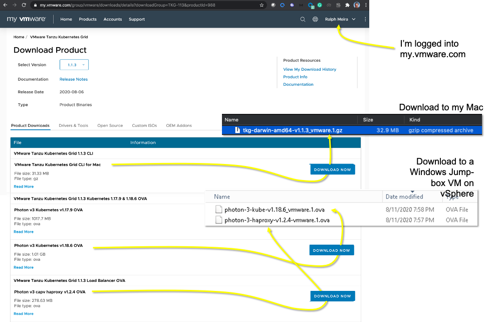

# Log/Notes from a TKG deployment to a vSphere 6.7 Environment using TKG CLI on a MacBook

## Pre-requisites

1. VCSA environment that is based on +3x ESXi v6.7 Hosts: `vcsa67.pcf4u.com` 
2. `kubectl` CLI installed
3. Docker Desktop installed
4. MacOs and Docker (w/ 6GB RAM) System time synchronized with `time.google.com`
5. Follow the instructions found at: https://docs.vmware.com/en/VMware-Tanzu-Kubernetes-Grid/1.0/vmware-tanzu-kubernetes-grid-10/GUID-install-tkg-index.html

## Process that we will be following

1. Download the Tanzu Kubernetes Grid installer bundle to your local machine 
   - https://www.vmware.com/go/get-tkg --> download tkg-darwin-amd64-v1.1.3_vmware.1.gz
   - 
   
   

   
2. Use the Tanzu Kubernetes Grid command line interface (CLI) to *deploy* the Tanzu Kubernetes Grid management cluster and Tanzu Kubernetes clusters
3. Use the tools that Tanzu Kubernetes Grid provides to *configure* the Tanzu Kubernetes Grid instance

## 
